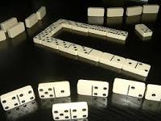

# DominoGame



## General

**Domino** is a board game that originated in China thousands of years ago, using six-sided dice. Over time, various variants of the game have been created by adapting its rules. The classic mode of play, known in Cuba, begins with players receiving their tiles. In a chosen order, each player takes turns placing a tile (if they have one). The goal is to be the first to empty your hand. If the game becomes blocked (known as a "trancada"), where no player has tiles that can be linked to the options on the table, the winner is determined based on a specific rule—usually the player with the fewest accumulated points in their hand.

**Dominos Game** is an implementation based on the general idea of this common game. It allows users to choose the rules they want to play by. Additionally, it's designed to be flexible, allowing for the easy implementation of new game variations without affecting the initial structure significantly. Variations in domino games often arise from different rules. Some of these rules include:

#### Tile Distribution

- The method of obtaining tiles (cards or any other objects with which players interact during their turn) varies. This includes the quantity of tiles distributed and the number of times they are dealt. Typically, games start in a neutral state to ensure some equality of conditions at the beginning, leaving the outcome partially to chance.

  In Domino Game, the **IShuffler** interface is used to model this rule.


```cs
public interface IShuffler
{
    void Shuffle(Player player, GameInformation gi, ref int index, Referee rf, [Optional] int cant);
}
```

This ensures that given a specific shuffler implementing the `IShuffler` interface, the desired mode of distribution can be selected. For this purpose, two shufflers, `shuffler1` and `shuffler2`, were created.

- **shuffler1**:
  - `shuffler1` is an implementation of the classic shuffler. Given a player, game information, and the index corresponding to the last dealt tile from the deck, it assigns each player the appropriate number of tiles based on the chosen domino option. For the standard 9-tile domino, it assigns 10 tiles, following the conventional rules of the classic game. 🎲

- *shuffler2*:

 - In this variation, parity is employed. If a player has an even index, when distributing tiles, the shuffler will have dealt an odd number of times up to that point. Consequently, the player will receive a total sum of points in their tiles that corresponds to that parity.

#### Termination

- When a game ends, the conditions based on the board state that determine the conclusion of the match come into play. The **IFinalized** interface is used, ensuring that the `EndGame` function determines the game's termination.

```cs
public interface IFinalized
{
    bool EndGame(GameInformation gm, Referee referee, ref int max);
}
```

Two implementations are provided:

1. **clasicEnd**: Determines termination based on the conventional mode. This occurs when a player no longer has tiles in hand or when none of the players' tiles can be played on the board.

2. **EndGameAbovePoints**: A variant that terminates when a random number of points is on the board. Specifically, given a number between 0 and the total points across all players' tiles, the game ends when that total is reached through the sum of all played tiles.

#### Winner

```cs
public interface IWinner
{
    string Win(Referee referee, GameInformation gm);
}
```

The `Win` function is responsible for determining the victorious player. Two implementations are provided:

1. **clasicWinner**:
   - This implementation follows the classic criteria: the winner is the player with no tiles left or the one with the fewest points based on the sum of their hand.

2. **Winner2**:
   - In this variation, the winner is determined based on both the number of tiles and the score. The player with the lowest product of these parameters wins.
#### Play Validators

In Domino Game, play validators determine whether a move is valid or not. A play consists of the tile selected by the player and the position where they want to place it. We often refer to tiles played by a player that cannot be linked with the available options on the board as "invalid moves" or "forros." The `IValidator` interface defines the `ValidPlay` method, which returns a boolean indicating whether a move is valid.

```cs
public interface IValidator
{
    bool ValidPlay(jugada jugada, GameInformation gi);
}
```

Two specific validators are implemented:

1. **`validator1`**:
   - This validator follows the classic play validation rules. It only considers a move valid when two tiles can be linked together.

2. **`validatorEvenOdd`**:
   - In this variation, a tile is formed based on the available options on the board. For example, if the current options on the board are 1 and 2, a new tile will have these corresponding values on its faces. If the weight (sum of values) of this tile is even (or odd), the move will be valid only if the weight of the played tile is also even (or odd). Of course, the played tile must be linkable to one of the existing options on the board. If no tiles have been played previously, any move is considered valid.

## Structure

Domino Game consists of a class library containing all the logical implementation. The following classes are used in this implementation:
- **All the tiles played during the game**
- **Current playable options**
- **List of all shuffled tiles**
- **Delegate responsible for calculating tile weights**
- **Storage for each player's moves**
- **Storage for the tiles not played by each player in a certain turn (passes)**
- **Auxiliary method used for tile distribution**: The `MakingRecords(int cant)` function arranges the tiles in different orders, simulating shuffling. This allows them to be taken as partitions of the tile set, with various distributions available for selection each time the method is used.
- **Function responsible for tracking the total points in all players' tiles**: The `shuffledPoints(Referee referee)` function calculates the total points distributed across all players' tiles.
- **Function to determine the total weight of all tiles on the board**: The `PointsInGame()` function calculates the cumulative weight of all tiles currently on the board.

## InformationForPlayer

**InformationForPlayer** provides a report containing all the data a player needs during their turn to make informed decisions. This class is designed to be the sole source of information accessible to the player, preventing them from changing game elements arbitrarily and allowing them to follow a strategic approach. 😊
## Variations

Variations of each previously explained rule are implemented.

## Records

In Records, a tile is defined. A list of values is assigned to the elements, creating a series of elements with assigned values.

## Play (jugada)

Here, a play is defined as the tile to be played and the position where it should be placed.

## Rules

Game rules that can be varied are found here.

## Players

In Players, strategies for the players are defined. It includes a general player class that defines the player and the main method that, given the state of the board, determines a play. The implementations include:
- **Manual Player**: Represents a human player who makes decisions based on their own judgment.
- **Random Player**: Explores available options on the board based on the report provided.
- **Greedy Player**: Always aims to play the "optimal" move whenever possible.
- **Data Player**: Plays to secure dominance with the most frequent number in their hand (also known as "data").

## Referee
The referee is responsible for modeling the game's mechanics. Here are the key functions performed by the referee:

- **Game Rules and Initialization**:
  - The referee receives the game rules and initializes the necessary components.
  - It keeps track of the tiles distributed to each player.

- **Handling Player Moves**:
  - When a player makes a move, the referee processes it.
  - It updates the game information (e.g., available options, played tiles) based on the player's move.
  - The referee adds the played tile to the board at the specified position.

- **Validating Playability**:
  - The referee checks whether a player has any tiles in their hand that can be linked with the tiles on the board (valid play).
  - If a player cannot play from their hand, the referee allows them to draw from the boneyard (remaining tiles).

- **Providing Information to Players**:
  - The referee constructs the report given to players during their turn.
  - This report contains all relevant information needed for players to make informed decisions.


